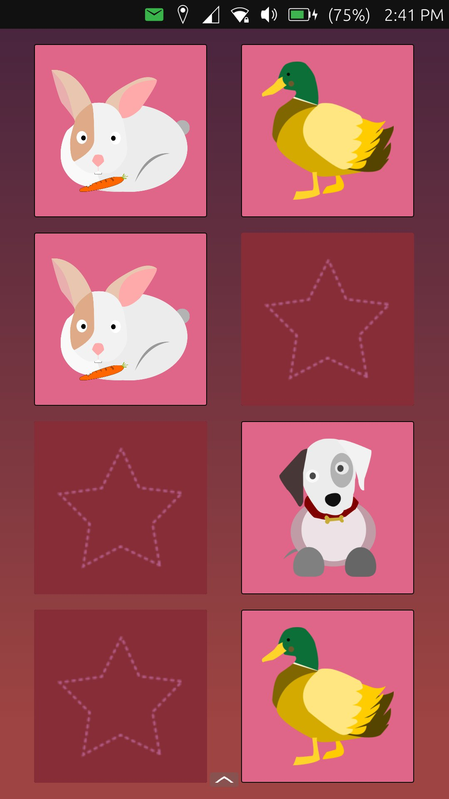

# pairsUp

A simple matching cards game for UT intended for learning purposes.  

Current goal is to finish implementing the game logic. Once that's sorted out, the idea is to continue adding stuff such as music, sound fx, custom themes and more. Anyway the idea is to keep it simple... and family friendly. Feel free to contribute to the code :)

Special thanks to Kugi Eusebio for all the support, likewise to Milan Korecky for the testing.

## Pending 
~~-Add difficulty selector.~~

~~-Shuffle/reset game when all cards are discovered.~~ **DONE.**

~~-FIXME: add a delay when flipping the cards to prevent the animation for getting stuck.~~ **DONE.**

~~-Add music (in progress)~~ **DONE**

-Add main menu
## Assets

In-house :)

## Available on: 

## License

Copyright (C) 2022  Mauricio Duarte

This program is free software: you can redistribute it and/or modify it under the terms of the GNU General Public License version 3, as published
by the Free Software Foundation.

This program is distributed in the hope that it will be useful, but WITHOUT ANY WARRANTY; without even the implied warranties of MERCHANTABILITY, SATISFACTORY QUALITY, or FITNESS FOR A PARTICULAR PURPOSE.  See the GNU General Public License for more details.

You should have received a copy of the GNU General Public License along with this program.  If not, see <http://www.gnu.org/licenses/>.
